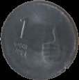

Here’s an improved and detailed README for your project:

---

# **Visual Recognition - Assignment 1**

## **Introduction**
This project is part of the **Visual Recognition** course and consists of two primary tasks:
1. **Coin Segmentation** – Detect and segment coins from an image using edge detection, contour analysis, and color filtering.
2. **Panorama Stitching** – Automatically stitch multiple images together to create a seamless panoramic view using feature matching and homography transformations.

---

## **Prerequisites**
Ensure the following dependencies are installed before running the scripts:

- **Python 3.10**  
- **NumPy** (`pip install numpy`)  
- **OpenCV** (`pip install opencv-python`)  
- **Matplotlib** (`pip install matplotlib`)  

---

## **Installation**
1. **Clone this repository**:
   ```sh
   git clone https://github.com/Tah1rTheT1ger/VR_Assignment1_TahirKhadarabad_IMT2022100.git
   cd VR_Assignment1_TahirKhadarabad_IMT2022100
   ```

---

## **How to Run**
### **1. Coin Segmentation**
Navigate to the **`scripts`** folder and run the Jupyter notebook `coins.ipynb`.

Alternatively, execute the script:
```sh
python coins.py
```
Ensure that the input image is placed in the `input_images` folder and update the image path in the script if necessary.

### **2. Panorama Stitching**
Navigate to the **`scripts`** folder and run the Jupyter notebook `panorama.ipynb`.

Alternatively, execute the script:
```sh
python panorama.py
```
Ensure that the images for panorama stitching are placed in the `input_images` folder and update their paths in the script if necessary.

---

## **Methods Used**

### **Coin Detection and Segmentation**
The approach consists of the following steps:

1. **Preprocessing:**
   - Convert the input image to grayscale.
   - Apply **Gaussian Blur** to remove noise.

2. **Edge Detection:**
   - Use **Adaptive Thresholding** to handle different lighting conditions.
   - Apply **Canny Edge Detection** to extract edges of coins.

3. **Contour Extraction and Filtering:**
   - Perform **Morphological Operations** to close gaps in detected edges.
   - Extract contours using `cv2.findContours`.
   - Filter coins based on **circularity** and **size**.

4. **Color-Based Filtering:**
   - Convert the image to HSV color space.
   - Use the **Hue** component to differentiate between silver and gold coins.

5. **Segmentation and Saving:**
   - Extract and save each detected coin as a separate image.

---

### **Panorama Stitching**
The following pipeline is used for panorama generation:

1. **Feature Detection and Matching:**
   - Use **ORB (Oriented FAST and Rotated BRIEF)** to extract key points.
   - Match descriptors using **BFMatcher** (Brute-Force Matcher) with **Hamming distance**.

2. **Homography Estimation:**
   - Compute the transformation matrix using **RANSAC** to reject outliers.
   - Apply **cv2.findHomography** to align images.

3. **Image Warping and Blending:**
   - Warp images onto a common coordinate system.
   - Merge images while handling seams and exposure differences.

4. **Cropping:**
   - Identify black borders and crop them using **contour-based bounding boxes**.

---

## **Results**

#### **Final Coin Segmentation Results**
| Coin 1 | Coin 2 | Coin 3 | Coin 4 | Coin 5 | Coin 6 | Coin 7 |
|---|---|---|---|---|---|---|
|  |  |  |  |  |  |  |


#### **Total Coins Detected**


---

### **Panorama Stitching**

| Detected Points |
|---|
|  |

Below is the final stitched panorama image:

| Stitched Panorama |
|---|
|  |

---

## **Observations**
### **Coin Detection**
- Some inscriptions on the coins were detected as edges, leading to false detections.
- Color filtering helped eliminate non-coin objects but may reject coins under uneven lighting conditions.

### **Panorama Stitching**
- A slight seam is visible in the stitched panorama due to:
  - **Misalignment** of key points.
  - **Lighting variations** across images.
  - **Lens distortions** (e.g., vignetting or barrel distortion).
- Increasing the number of key points and refining blending techniques could improve the results.

---

## **Future Improvements**
- Implement **Hough Circles** to improve circular object detection for coin segmentation.
- Use **SIFT or SURF** for feature matching in panorama stitching (currently not included due to licensing issues).
- Apply **image blending techniques** like multi-band blending for seamless panorama stitching.

---

## **License**
This project is licensed under the **[MIT License](LICENSE)**.

---
